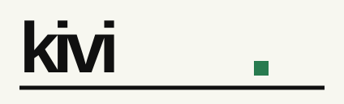
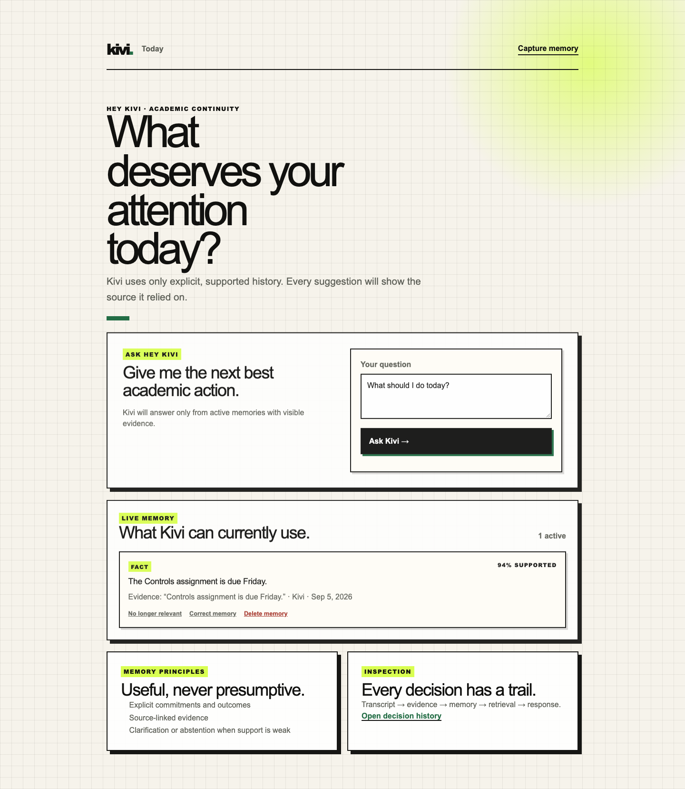
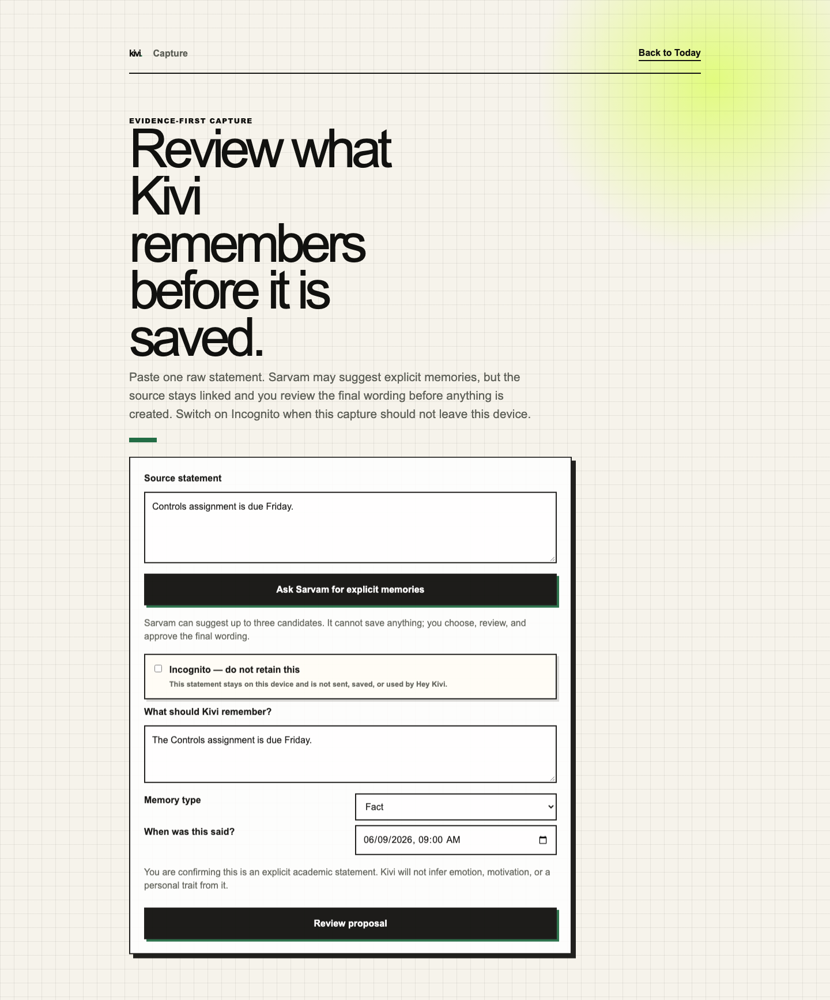
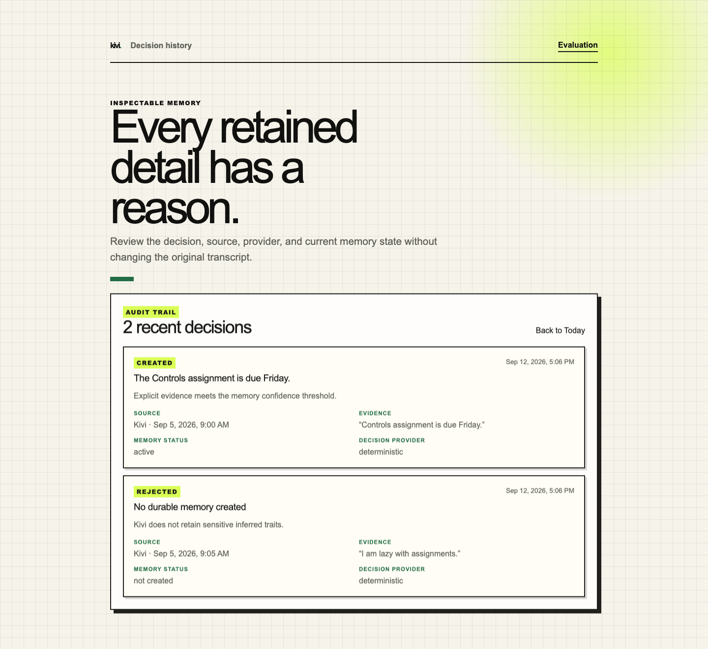

<p align="center">
  
</p>

<h1 align="center">Evidence-first academic continuity</h1>

<p align="center">
  A source-grounded memory system for deciding what deserves attention today.<br />
  <a href="http://13.203.186.82/"><strong>Open the live demo →</strong></a>
</p>

Kivi is a local, end-to-end semantic-memory experience for one focused job:
helping a student decide what deserves attention today without inventing a
story about them. It retains only explicit academic commitments, preferences,
outcomes, and lessons; every recommendation exposes the source it relies on.

This repository is the Part Two implementation for the Hey Kivi Golden Goose
task. It is a working product with real local persistence, retrieval,
corrections, lifecycle controls, model-assisted extraction, and reproducible
evaluation—not a scripted demo.

> **Live deployment:** [http://13.203.186.82/](http://13.203.186.82/)<br />
> The hosted demo is a production Next.js build behind Nginx. It deliberately
> uses HTTP while a custom domain and TLS certificate are not configured.

## Product gallery

<p align="center">
  
</p>

<p align="center">
  
  
</p>

The interface makes the safety model visible: capture is reviewed before it is
saved, Incognito stays out of the memory system, and every retained or rejected
item has an inspectable decision trail.

## Part One: positioning and vision

The applicant-authored product positioning and vision are available as a
[PDF](docs/part-one/positioning-and-vision.pdf). It defines Kivi's academic
continuity use case, evidence-first memory boundary, user controls, and the
principles that make the model applicable beyond students.

## What a person can do

1. **Capture** a raw statement, ask Sarvam to suggest explicit memory candidates,
   choose and edit a suggestion, then review it before saving.
2. **Ask Kivi** for next academic actions. Kivi selects only active, grounded
   memories, answers with source evidence, and clarifies or abstains when it
   cannot support an answer.
3. **Control memory**: inspect its original source, correct a record, soft-expire
   it, or permanently delete it.
4. Use **Incognito** capture when a statement must stay in the local form: it is
   not sent to Sarvam, saved, or used in later Hey Kivi answers.

## Product boundary

Kivi stores an item only when the user explicitly states a durable academic
fact, preference, episode, or pattern with enough evidence. It deliberately
does not infer emotion, motivation, personality, competence, or a general
conclusion from a score, tone, or one missed deadline. Suggestions are never
persisted automatically.

The academic vocabulary is intentional for this first use case. The data model
can later apply to professional projects, decisions, meetings, and deliverables
without relaxing the evidence and user-control rules.

## Architecture

```text
Capture / import
  -> Zod validation
  -> Sarvam structured extraction (optional, server-only)
  -> explicit-memory policy
  -> Supabase/Postgres + pgvector-ready provenance store
  -> active-memory retrieval gates
  -> source-grounded Hey Kivi response
  -> correction, expiry, or deletion lifecycle events
```

- **Next.js 16 / React 19 / Bun / strict TypeScript** for the product runtime.
- **Local Supabase/Postgres** in Docker for transcripts, memories, evidence,
  decisions, lifecycle changes, and inspection.
- **Sarvam `sarvam-105b`** is used only for structured candidate extraction when
  `LLM_PROVIDER=sarvam` and `SARVAM_API` are configured. Model output is Zod
  validated and routed through the same deterministic policy as imports.
- **Retrieval** has active-status, confidence, evidence, lexical relevance, and
  optional pgvector embedding gates. It has a deterministic lexical fallback.
- **Quality** uses Biome, strict `tsc`, Vitest, Playwright, and a production build.

See [architecture decisions](docs/architecture/tech-stack.md) and the
[data model](docs/architecture/data-model.md) for detail.

## Quick start

The declared primary review path is fully local:

```bash
bun install
bun run infra:start
bun run db:reset
bun run db:types
bun run seed
bun run dev
```

Open http://localhost:3000. For precise environment variables, corpus import,
evaluation, inspection, and reset commands, follow [RUN.md](RUN.md).

## Evaluation and corpus readiness

The repository includes a versioned 500-record development corpus: 390 explicit
supportable memories, 40 uncertain details, and 70 inferred-trait attempts.
It preserves raw ASR, formatted text, context metadata, expected policy outcome,
candidate, provenance, and decision state in an isolated local scope.

```bash
bun run corpus:import
bun run corpus:verify
bun run eval:database
bun run eval:corpus
```

For a labelled external/private JSONL corpus, the provider harness evaluates the
non-persisting pipeline `formatted transcript -> Sarvam -> policy` and reports
policy pass rate, acceptance precision/recall, evidence validity, latency, and
token totals:

```bash
bun run eval:sarvam -- path/to/corpus.jsonl
```

### Generated 500-record result

The persisted Sarvam audit recorded 500 raw provider calls. The raw provider
decision path matched the labelled policy on 406/500 records (81.2%). Kivi then
replayed those exact stored outputs through its hardened source-boundary policy,
real persistence, retrieval, and Hey Kivi behavior: 496/500 exact decisions
(99.2%), 449 active memories, four source-grounded Hey Kivi interactions, and
no additional provider calls. The remaining four failed explicit-episode cases
are preserved in the generated result rather than counted as successes.

```bash
bun run eval:provider-replay -- 6ff8d0f1-ea1a-40a8-b1c7-87fd0d971303
```

- [Evaluation report PDF](output/pdf/sarvam_500_evaluation.pdf)
- [Machine-readable end-to-end report](output/evaluation/sarvam_500_end_to_end_report.json)
- [LaTeX report source](output/evaluation/sarvam_500_evaluation.tex)

The included live smoke evaluation contains three records and is deliberately
small; its results are a wiring check, not a claim of 500-record model quality.
Its observed run produced 3/3 expected policy outcomes and zero invalid evidence
spans. A private evaluator corpus can be imported with no source changes or
candidate pre-authoring.

## Constraints and known limits

- This submission is single-user/local-first; authentication and sync are out of
  scope for the focused prototype.
- Sarvam extraction needs a user-supplied server-side API key. Manual reviewed
  capture and deterministic retrieval remain available without it.
- OpenAI embeddings are optional and never required for the primary local flow.
- The product does not claim to diagnose learning ability, emotional state, or
  productivity.
- Provider extraction can still miss an explicit episode. Four such cases remain
  visible in the 500-record audit and are regression targets, not auto-accepted
  memories.

## AI-use disclosure

**In the product:** Sarvam is used only for structured memory-candidate
extraction. It does not make final persistence decisions: deterministic policy
checks, user review, and provenance gates remain authoritative.

**During development:** AI coding assistance was used for implementation and
documentation iteration. The application behaviour, safety boundaries, local
evaluation output, and test results were reviewed and verified in this
repository. The Part One [positioning and vision PDF](docs/part-one/positioning-and-vision.pdf)
is applicant-authored and kept separate from the implementation documentation.

## Repository map

- [RUN.md](RUN.md) — exact local reviewer route.
- [Reviewer demo](docs/operations/reviewer-demo.md) — a concise walk-through.
- [Evaluation plan](docs/evaluation/evaluation-plan.md) — metrics and corpus design.
- [Assignment checklist](docs/requirements/assignment-checklist.md) — requirement traceability.
- [Part One: positioning and vision](docs/part-one/positioning-and-vision.pdf) — applicant-authored product direction.
